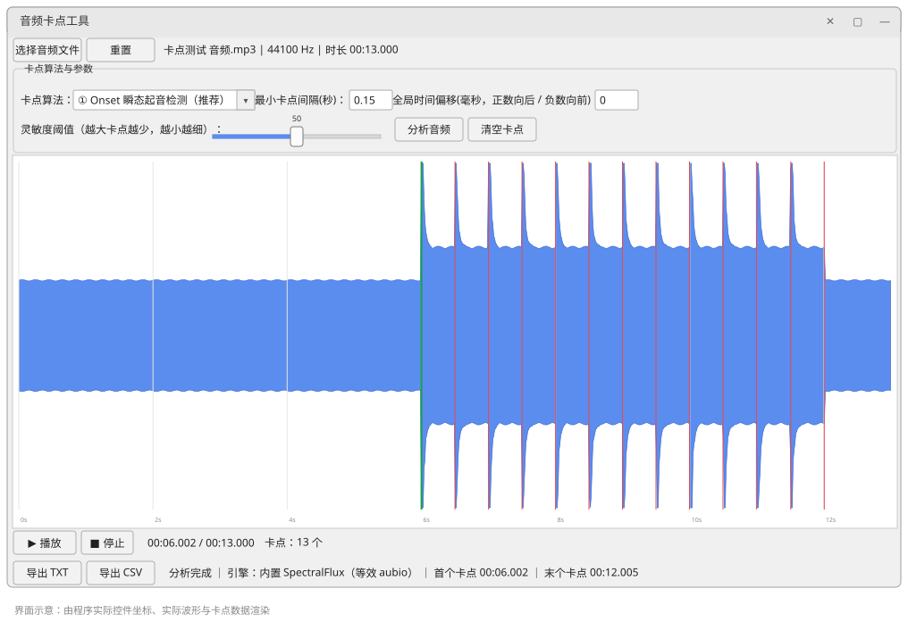

# BeatMark

> 给剪辑找卡点的本地小工具：导入音频 → 自动识别鼓点/重音位置 → 导出时间戳

[](LICENSE)
[](https://www.python.org/)
[](#下载使用)
[](#隐私与安全)

Python + Tkinter ，依赖极少（numpy + miniaudio）



## 功能

- **三种卡点算法**，针对不同场景
  - ① **Onset 瞬态起音检测**（默认，剪辑卡点推荐）：识别声音的起跳边缘，捕捉鼓点敲击瞬间。不会被长音、持续人声误触发，卡点时间对齐节拍更准。
  - ② **音量峰值检测**：找波形振幅最高点。适合定位音频的高潮/响度位置，缺点是标记会轻微滞后，长音容易产生多余标记。
  - ③ **等间隔卡点**：从 0 秒起每隔设定的"间隔秒数"均匀放一个卡点。适合需要固定节奏/定时间隔的场景（如卡点视频固定节奏、转场定时）。
- **三个可调参数**（按算法自动切换）：灵敏度阈值 + 最小卡点间隔（Onset、峰值用）/ 间隔秒数（等间隔用）+ 全局时间偏移（毫秒，用来补偿音频延迟）。
- **波形预览**：画布上画出波形，识别出的卡点用竖线标记；支持播放试听，播放时显示绿色时间指针；点击波形任意位置可跳转播放。改完参数点【分析音频】即重新计算并刷新。
- **两种导出格式**：TXT（每行一个秒数）与 CSV（时间(秒), 时间(毫秒)）。
- **重置**：一键清空当前音频、波形和卡点标记，方便换下一首。


## 使用流程

1. **选择音频文件** —— 支持 MP3 / WAV / FLAC / OGG 等常见格式（中文路径、中文文件名都支持）
2. **选择卡点算法** —— 剪辑卡点选 ①，找高潮位置选 ②，要均匀踩点选 ③
3. **调整参数** —— 见下表
4. 点 **【分析音频】** —— 波形上出现红色卡点竖线
5. **播放试听** —— 核对卡点是否落在重音上，对不上就调参数重算，或用全局时间偏移整体微调
6. **导出 TXT / CSV** —— 拿去剪映、AE、PR 里对轨

## 参数说明

| 参数 | 范围 | 默认 | 作用 | 怎么调 |
| --- | --- | --- | --- | --- |
| 灵敏度阈值 | 0 ~ 100 | 50 | 阈值越高，只有明显的重鼓点会被标记（① ② 使用） | 卡点太碎/太多少 → 调大；漏掉轻鼓点 → 调小 |
| 最小卡点间隔 | ≥ 0 秒 | 0.15 | 两个卡点之间的最小间隔，防止同一个鼓点被重复标记（① ② 使用） | 鼓点非常密时可调小到 0.1；只想留每拍 → 调到 0.5 左右 |
| 间隔秒数 | > 0 秒 | 1.0 | 等间隔模式下两个卡点的间距（③ 使用） | 想要每 0.5 秒一个卡点 → 填 0.5；想要 2 秒一个 → 填 2 |
| 全局时间偏移 | 毫秒（可正可负） | 0 | 所有卡点统一向后（正）/ 向前（负）平移 | 卡点整体比画面早或晚一点点时，用它整体补偿 |


## 导出格式

`导出 TXT` —— 每行一个卡点时间，单位秒，三位小数：

```
6.002
6.502
7.001
7.500
```

`导出 CSV` —— 两列，方便导入剪映、AE 查阅（用 Excel 打开也不会乱码）：

```csv
时间(秒),时间(毫秒)
6.002,6002
6.502,6502
7.001,7001
```

## 从源码运行

> 直接跑源码**不需要打包**：`beatmark.py` 本身就是完整程序，改完代码重新运行就生效。
> 打包成 exe 只是为了让**没装 Python 的人**也能用，或者方便分发。

### 双击 `run_source.bat`

第一次运行会自动创建 `.venv` 虚拟环境并安装依赖（需要已装 Python 3.8+），之后每次双击就直接打开界面。

想用命令行功能也可以直接传参数：

```bat
run_source.bat --version
run_source.bat --selftest 音频文件.mp3 --algo peak --sensitivity 60
run_source.bat --selftest 音频文件.mp3 --algo interval --interval 0.5
```

```


## 命令行自检（不开界面）

改完算法或打包后，用自检模式快速验证结果是否正确：

```bash
python beatmark.py --selftest 音频文件.mp3
python beatmark.py --selftest 音频文件.mp3 --algo peak --sensitivity 60 --min-gap 0.2 --offset 30
python beatmark.py --selftest 音频文件.mp3 --algo interval --interval 0.5
python beatmark.py --version
```

输出示例：

```
文件: song.mp3
采样率: 44100 Hz  时长: 13.000 s  算法: onset  引擎: 内置 SpectralFlux（等效 aubio）
灵敏度: 50  最小间隔: 0.150s  间隔: 1.000s  偏移: 0.0 ms
卡点数量: 13
前 20 个卡点(秒): 6.002, 6.502, 7.001, 7.500, ...
```


## 技术栈

| 用途 | 方案 |
| --- | --- |
| 界面 | Tkinter（Python 自带） |
| 音频解码 | miniaudio（自带 mp3/wav/flac/ogg 解码器，纯 wheel 依赖） |
| 播放 | miniaudio PlaybackDevice（WASAPI） |
| 数值计算 | NumPy（FFT 谱通量、包络、局部极值） |
| 起音检测 | 相对谱通量 + 自适应中值阈值（等效 aubio 默认检测器） |
| 打包 | PyInstaller 单文件 / 文件夹 |

## 贡献

欢迎提 Issue 和 PR。详情请查看 [贡献指南](CONTRIBUTING.md)。


## 安全

本工具完全离线运行，音频数据不会上传到任何服务器。详见 [安全策略](SECURITY.md)。

## 许可

[MIT License](LICENSE) © 2026 Lyajjyurot
